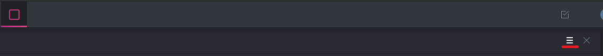
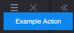

# Example Action App
The Example Action app is an example of a custom action in MediaCentral Cloud UX. 

Once installed MediaCentral Cloud UX will have a new Pane called "CloudUX-Action-Example".

For more info go to [documentation](http://developer.avid.com/mcux_ui_plugin/clux-api/actions-api.html)

This example was created using MediaCentral Cloud UX Toolkit:
* [cloudux-starter-kit](https://www.npmjs.com/package/cloudux-starter-kit)

Action can be found there:

Click to toggle actions:

See action displayed:

Action [definition](src/app/action.js "Action"):

Binding [definition](src/app/binding.js "Action"):

## Running the examples
To run these examples you will need a running MediaCentral Cloud UX server running. 

**Running:**
1. Change connections settings in [src/project.act](src/project.act)
2. In CLI type **npm install**
3. Then in CLI type **npm start**
